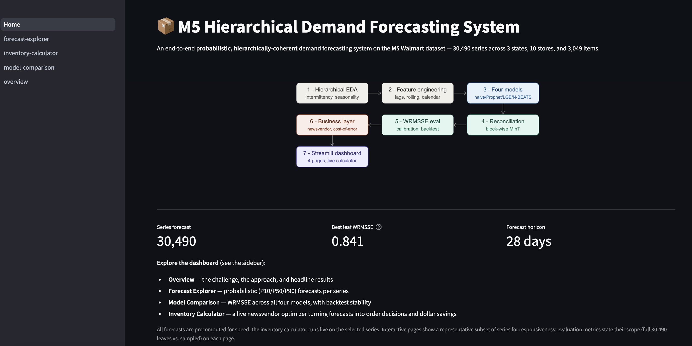
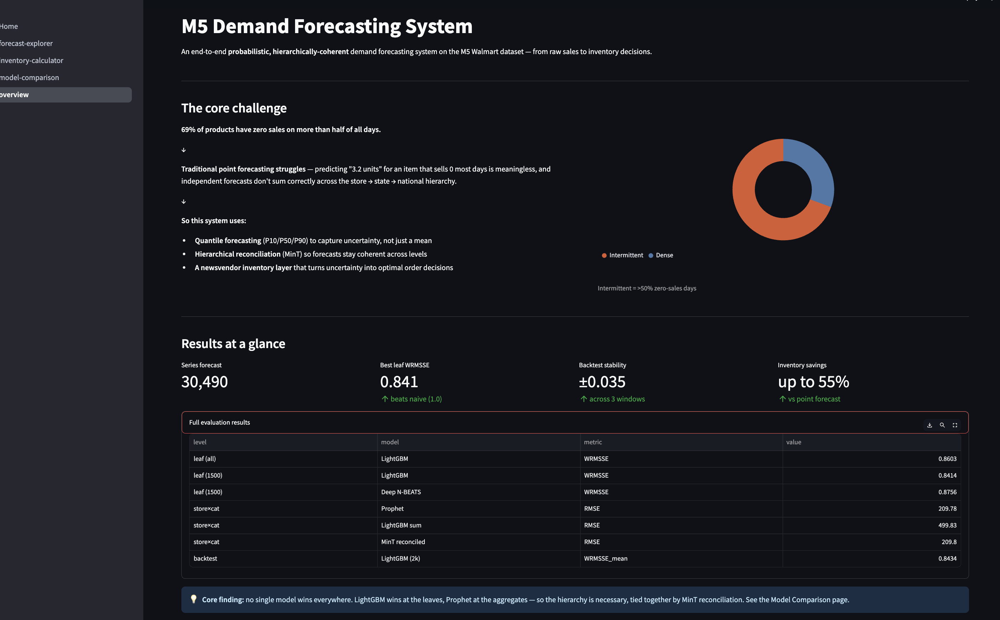
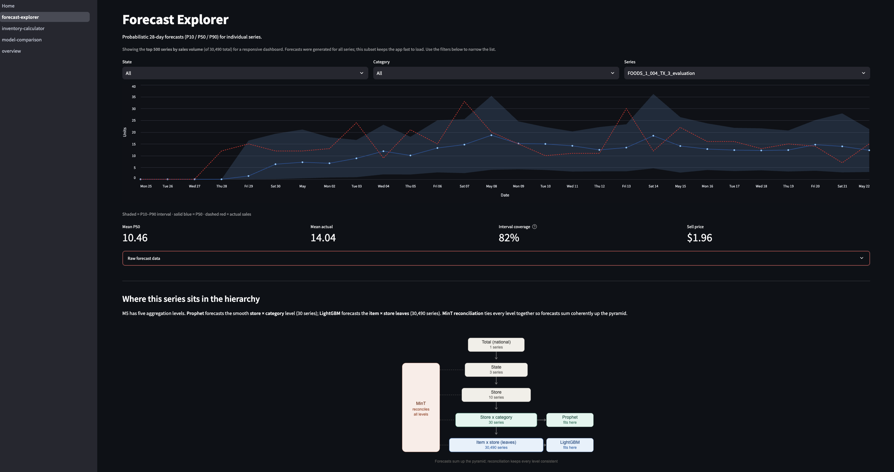
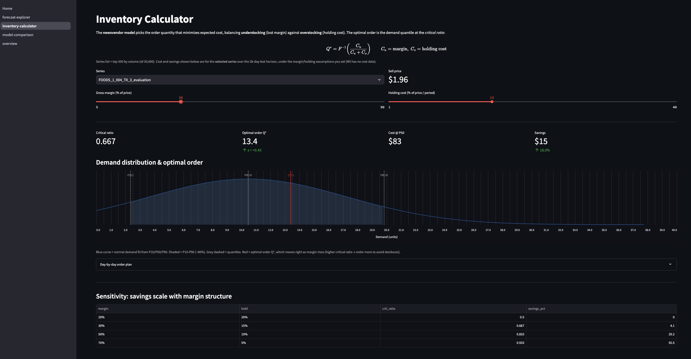

# M5 Hierarchical Demand Forecasting System

An end-to-end **probabilistic, hierarchically-coherent** demand forecasting system
on the [M5 Walmart dataset](https://www.kaggle.com/competitions/m5-forecasting-accuracy)
— from raw sales to inventory decisions. 30,490 series across 3 states, 10 stores,
and 3,049 items.

**[▶ Live dashboard](YOUR_STREAMLIT_URL_HERE)**  ·  4 interactive pages



---

## Why this project

**69% of M5 item-series are intermittent** — they have zero sales on more than half
of all days. A single point forecast ("3.2 units") is meaningless for such series,
and independent per-item forecasts don't sum coherently up the store → state →
national hierarchy. This system addresses both:

- **Quantile forecasting** (P10/P50/P90) to capture uncertainty, not just a mean
- **Hierarchical reconciliation** (MinT) so forecasts stay coherent across levels
- **A newsvendor inventory layer** turning uncertainty into optimal order decisions

## Results

| Level | Model | Metric | Value |
|-------|-------|--------|------:|
| Leaf (all 30,490) | LightGBM | WRMSSE | **0.860** |
| Leaf (1,500 subset) | LightGBM | WRMSSE | 0.841 |
| Leaf (1,500 subset) | N-BEATS | WRMSSE | 0.876 |
| Store×cat | Prophet | RMSE | **210** |
| Store×cat | LightGBM leaf-sum | RMSE | 500 |
| Backtest (3 windows) | LightGBM | WRMSSE | 0.843 ± 0.035 |

- **All models beat the seasonal-naive baseline** (WRMSSE < 1.0).
- **Core finding:** no single model wins everywhere — LightGBM wins at the leaves,
  Prophet at the aggregates. The hierarchy is necessary, tied together by MinT.
- **Inventory:** quantile-aware newsvendor ordering saves 4% at base-case economics,
  scaling to **55% for high-margin items** vs ordering at the point forecast.

## The pipeline

1. **Hierarchical EDA** — intermittency (69.4%), seasonality, Christmas closures
2. **Feature engineering** — lags, rolling stats, calendar, events, price (leakage-safe)
3. **Four models** — seasonal-naive · Prophet · LightGBM-quantile · N-BEATS
4. **Reconciliation** — bottom-up + block-wise structural MinT
5. **Evaluation** — WRMSSE, calibration, 3-window backtest
6. **Business layer** — newsvendor optimization, cost-of-error, sensitivity
7. **Dashboard** — 4-page Streamlit app with a live inventory calculator

## Dashboard

| Overview | Forecast Explorer | Inventory Calculator |
|----------|-------------------|----------------------|
|  |  |  |

- **Overview** — the challenge, approach, and headline results
- **Forecast Explorer** — probabilistic fan charts per series
- **Model Comparison** — WRMSSE across models, backtest stability
- **Inventory Calculator** — live newsvendor optimizer (drag margin → watch Q* move)

## Run locally

```bash
git clone https://github.com/YOUR_USERNAME/m5-hierarchical-forecasting.git
cd m5-hierarchical-forecasting
pip install -r requirements.txt
streamlit run app/Home.py
```

To reproduce the full pipeline (notebooks 01–07), install the training deps:
```bash
pip install -r requirements-dev.txt
```
The deep model is trained separately: `python run_deep_local.py` (see
[Methodology.md](docs/Methodology.md)).

## Documentation

- [Architecture](docs/Architecture.md) — pipeline, repo layout, design choices
- [Methodology](docs/Methodology.md) — data, features, models, evaluation
- [Limitations](docs/Limitations.md) — honest caveats and compute-budget decisions

## Tech stack

Python · pandas · LightGBM · Prophet · Darts (N-BEATS) · scipy · Streamlit · Altair

---

*Built as a portfolio project emphasizing production-style thinking: evaluation
rigor (WRMSSE, calibration, backtesting), business framing (inventory decisions),
hierarchical coherence, and honest documentation of limitations.*